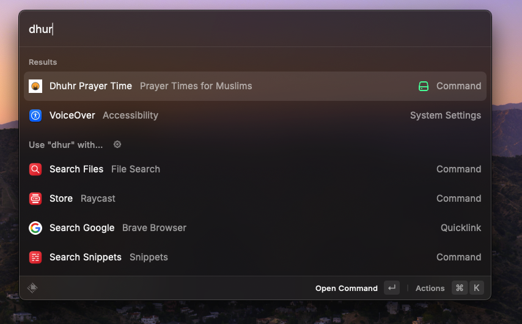
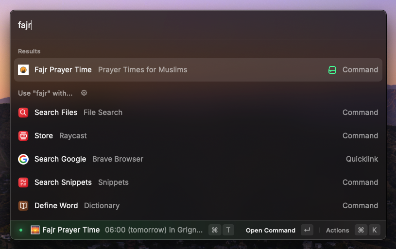
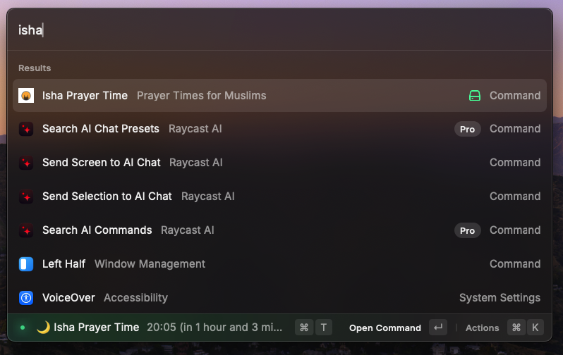

# Muslim Prayer Times Extension for Raycast

## Description

A Raycast extension that provides instant access to Muslim prayer times based on your current location. Get accurate prayer times for Fajr, Dhuhr, Asr, Maghrib, and Isha prayers with a simple command.

### Features:

- 🌍 Automatic location detection
- 🔄 Easy refresh with ⌘R
- 📍 Location-aware updates
- 🎯 Precise timing information in 12-hour format

## Commands

- `Fajr` - Get the time for Fajr prayer
- `Dhuhr` - Get the time for Dhuhr prayer
- `Asr` - Get the time for Asr prayer
- `Maghrib` - Get the time for Maghrib prayer
- `Isha` - Get the time for Isha prayer

## Screencast

## Installation

1. Install [Raycast](https://raycast.com/)
2. Search for "Prayer Times for Muslims" in Raycast Store
3. Install the extension

## Usage

1. Open Raycast
2. Type the name of any prayer (e.g., "Fajr" or "Asr")
3. Press Enter to see the prayer time
4. Use ⌘R to refresh the time

## Technical Details

- Uses the Aladhan API for accurate prayer time calculations
- Automatic geolocation through IP-based location detection
- Real-time time difference calculations
